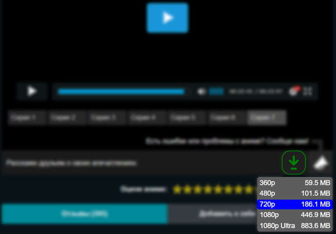
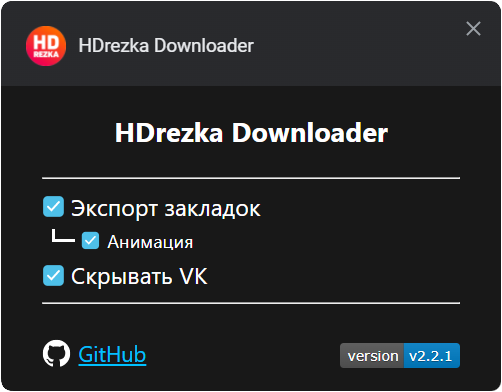
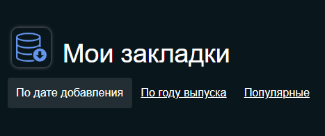

# HDrezka Helper

Добавляет кнопку «Скачать» под видео. Экспорт закладок и многое другое.

#### Работает с новым API от 05.01.2022

 

   

### Tampermonkey:
1. Установите **[Tampermonkey](https://www.tampermonkey.net/)**.
2. Установите **[Скрипт](https://raw.githubusercontent.com/SuperZombi/HDrezka-downloader/main/hdrezka_helper.user.js)**.

## Настройки

   

## Новое:
* 

Экспорт закладок.

* Скрытие блока с группой ВК.
* Скачивание субтитров

#### <a href="https://www.donationalerts.com/r/super_zombi">Поддержать</a> (Но сейчас лучше напишите на почту и я вышлю вам реквизиты)
